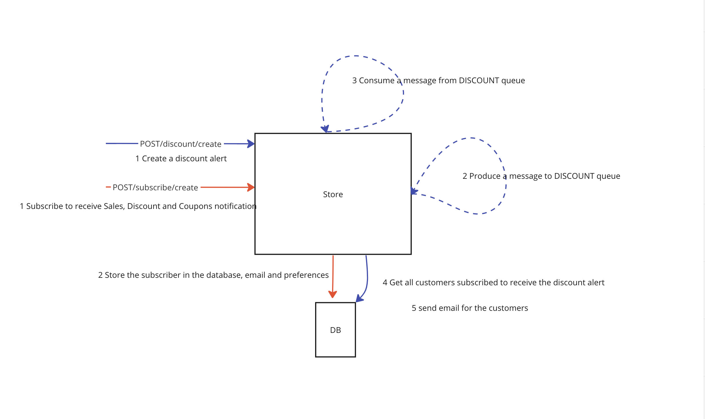

# Store Notification is a Work in Progress

The Idea is create a service that enables stores to send comunication for their customers.
Customer can subscribe to receive notifications when a sale, a new coupon or a product dicount is created.
Store can create a sale, coupon and a product discount alert.
Each customer registered to receive this notifications will receive an email.



To run locally, you will need [docker](https://www.docker.com/) installed in your machine.

1 - Startup our rabbitmq server in docker

run:  ``` docker-compose up```

2 - Install dependencies

run:  ``` yarn install ``` or ``` npm install ```

3 - Build the project

run:  ``` yarn build ``` or ``` npm run build ```


4 - Start the project

run:  ``` yarn start ``` or ``` npm run start ```


Still in progress
- [ ] Consumer
- [ ] Endpoint for sale and discount
- [ ] Endpoint to remove a subscriber from a subscriber list
- [ ] Mailer
- [ ] Swagger
- [ ] Tests

